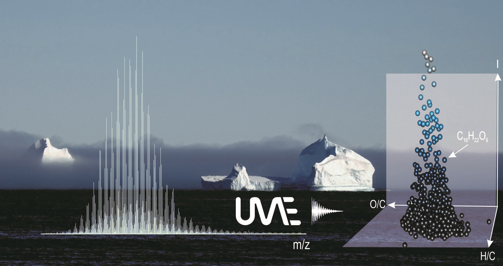

```{r echo = FALSE}
old_opts <- options(width = 100L)
on.exit(options(old_opts), add = TRUE)
```


[{width="296"}](https://www.awi.de/en/ume)

*UltraMassExplorer* (`ume`) is a package that uses exact molecular masses (derived from high-resolution mass spectrometry) to assign molecular formulas. UME provides tools to evaluate and visualize results (details described in [Leefmann et al. 2019](https://analyticalsciencejournals.onlinelibrary.wiley.com/doi/abs/10.1002/rcm.8315)). UME is also available as a graphical user interface via a [UME R Shiny App](https://www.awi.de/en/ume).

---

```{r install, eval=TRUE, echo=FALSE, warning=FALSE, message=FALSE}

library(ume)
library(pander)
#library(formatR)

# knitr::opts_chunk$set(
#   tidy.opts = list(width.cutoff = 60),  # wrap code at ~60 characters
#   tidy = TRUE
# )

# only demo library ume::lib_demo is used in this vignette
  data(lib_demo)

```

## Getting started

The [peaklist](#peaklist) (pl) is the main UME entry point. 

Your peak list can be a data.frame / data.table or text-files (txt, csv, tsv).
`as_peaklist()` checks and imports your source file. 

```{r eval=FALSE}

pl <- as_peaklist("your_path_to.csv")

```

For quick-starting the `UME` demo peak list (`ume::peaklist_demo`) can be used.

**Molecular formula assignment** is based on the [molecular formula library](#formula_library)
 (`formula_library`).
Two ready-to-use libraries can be downloaded from Zenodo:

```{r eval=FALSE}

lib <- download_library("lib_02.rds", dest = paste0(dirname(getwd()), "/lib_02.rds"))
# lib <- download_library("lib_05.rds", dest = paste0(dirname(getwd()), "/lib_05.rds"))

```

If you provide a local path with the argument `dest = `, the download will be performed only once. Thereafter the local copy will be loaded.

For quick-starting the demo library (`ume::lib_demo`) can be used.

## 1. Overview UME data workflow

1.  Analyse the input format of the peak list.
2.  Calculate neutral masses.
3.  Assign molecular formulas (based on a pre-defined formula library).
4.  Evaluate stable isotope information.
5.  Add information on existing knowledge of molecular formulas.
6.  Calculate evaluation parameters (e.g. DBE, nominal mass, KMD, etc.).
7.  A posteriori formula filtering.
8.  Normalize peak magnitudes.
9.  Set the order of columns in the results. 

### All of these tasks can be executed in just two steps:

#### Formula assignment and calculation of evaluation parameters

```{r example_short1, eval = F, warning=FALSE}

  mfd <- ume_assign_formulas(pl = peaklist_demo,
                             formula_library = lib, 
                             pol = "neg", 
                             ma_dev = 0.5, 
                             remove_isotopes = T)
```

#### Formula filtering (subsetting) and normalization

```{r example_short2, eval = F, warning=FALSE}

  mfd_filt <- ume_filter_formulas(
    mfd = mfd,
    remove_isotopes = TRUE,
    normalization = "bp",
    norm_int_min = 0.5,
    blank_file_ids = 1,
    blank_prevalence = 0.5,
    dbe_o_max = 10,
    oc_min = 0.2, oc_max = 1.2,
    c_iso_check = TRUE,
    dbe_max = 30,
    p_min = 0, p_max = 0,
    mz_min = 150, mz_max = 650
    )
```

```{r function_arguments, eval = F, warning = F, echo = F}
  args(ume::filter_mf_data)
  args(ume::filter_int)
  
 #All available filter arguments: 
  help(ume_filter_formulas)
  
```

### Alternatively, the workflow can be performed in single steps:

```{r example_long, eval = F, echo = TRUE}
# Step 1: Assign formulas (checks the peaklist format and calculates neutral masses and mass accuracy)
  # calc_neutral_mass() and calc_ma_abs()
  mfd <- assign_formulas(pl = ume::peaklist_demo, formula_library = ume::lib_demo,
                        pol = "neg", ma_dev = 0.5, verbose = TRUE)
                        
# Step 2: Verify the existence of the major isotope signals and their magnitudes
  mfd <- eval_isotopes(mfd = mfd, remove_isotopes = TRUE, verbose = TRUE)

# Step 3: Calculate evaluation parameters
  mfd <- calc_eval_params(mfd = mfd, verbose = TRUE)

# Step 4: Add known classification for formulas
  # to do: the categories should be listed in one column containing the category assignment
  mfd <- add_known_mf(mfd = mfd)

# Step 5: Remove all formulas that occur in one or more blank analyses
  # The demo peaklist contains one blank spectrum named "Blank" (file_id = 1)
  # This removes all molecular formulas recorded in the blank from the entire dataset
  mfd <- remove_blanks(mfd = mfd, blank_file_ids = 1, blank_prevalence = 0)
  
# Step 6: Filter formula table according to evaluation parameters (generated in step 3)
  mfd_filt <- filter_mf_data(mfd = mfd, 
                             select_file_ids = 2:5,
                             dbe_o_max = 10,
                             oc_min = 0.2,
                             oc_max = 1.2,
                             verbose = TRUE)
    
# Step 7: Normalize intensities
  mfd_filt <- calc_norm_int(mfd = mfd_filt, normalization = "bp", verbose = TRUE)
  
# Step 8: Filter by (relative) peak magnitude (in this case: >= 5 percent base peak intensity)
  mfd_filt <- filter_int(mfd = mfd_filt, norm_int_min = 0.5, verbose = TRUE)

# Step 9: Normalize intensities
  mfd_filt <- calc_norm_int(mfd = mfd_filt, normalization = "bp", verbose = TRUE)
  
# Step 10: Order the columns of the results table  
  mfd_filt <- order_columns(mfd = mfd_filt)  

# Alternative using pipe operator:
  mf_data_demo |>
    eval_isotopes(remove_isotopes = T) |>
    calc_eval_params() |>
    add_known_mf() |>
    order_columns()
    
```

## 2. Visualization and statistics
**Selected plot functions:**

```{r eval = FALSE, warning=FALSE}

# Mass spectrum
  uplot_ms(pl = ume::peaklist_demo, label = "file", 
           plotly = T,
           logo = F)

# Multivariate statistics
  # Multi-dimensional scaling:
    uplot_cluster(mf_data_demo[file != "Blank"], grp = "file", int_col = "i_magnitude")$mds
    
  # Cluster dendrogram
    uplot_cluster(mf_data_demo[file != "Blank"], grp = "file", int_col = "i_magnitude")$dendrogram

# Summary statistics
  calc_data_summary(mfd = ume::mf_data_demo)

# Mass accuracy
  uplot_freq_ma(mfd = ume::mf_data_demo)
  
# Element frequency
  uplot_freq(mfd = ume::mf_data_demo, var = "14N")

# van Krevelen 
  uplot_vk(mfd = ume::mf_data_demo, size_dots = 3)
  
# Precision isotope abundance
  uplot_isotope_precision(mfd = ume::mf_data_demo, 
                          z_var = "nsp_tot", 
                          tf = F, 
                          interactive = T, logo = T) 

# Carbon versus mass
  uplot_cvm(mfd = mf_data_demo, z_var = "co_tot", interactive = TRUE)
    
```

## 3. Re-calibration of peaklists

Automated calibration can be performed with existing calibration lists stored in ume::known_mf. The function "ume::calc_recalibrate_ms" assigns calibrants to the peak list and analyses the mass accuracy. Three outlier tests are performed and only those assigned calibrants that pass all three tests are used for recalibration. The recalibration is based on a linear model. The function output is a list object that contains a summary on calibrants and figures that compare the calibration status before and after recalibration. For example:

```{r eval = F, warning=FALSE}
output_recal <- calc_recalibrate_ms(
  pl = peaklist_demo[file != "Blank"],
  calibr_list = "marine_dom",
  pol = "neg",
  min_no_calibrants = 3,
  ma_dev = 1,
  formula_library = lib_demo
)

summary(output_recal)
output_recal$cal_stats # summary statistics for each file_id in peaklist

# Result plots  
  output_recal$fig_box_before
  output_recal$fig_box_after
  output_recal$fig_hist_before
  output_recal$fig_hist_after
  
# The re-calibrated peaklist is available via
  output_recal$pl
  
# It can directly be used to start a new formula assignment process (see above):
  mfd_recal <- ume::ume_assign_formulas(
    pl = output_recal$pl,
    formula_library = ume::lib_demo,
    pol = "neg",
    ma_dev = 1
  )
  
# Automated mass accuracy sub-setting can be obtained using the column "ppm_filt".
# It is based on the quantiles 97.5% and 2.5% of all CHO formulas assigned.
  
  mfd_recal <- mfd_recal[abs(ppm) <= ppm_filt]
  
  uplot_freq_ma(mfd_recal)
  
```

## 4. UME core data objects

### Mass Peak List {#peaklist}

The mass calibrated *peak list* is the core of the `ume` work flow. The peak list (pl) is a table [(as R data.table)](https://www.rdocumentation.org/packages/data.table/) that contains information from one or several mass spectrometric analyses:

-   Analytical data:

    -   Mass over charge value (mz)
    -   Mass peak magnitude (i_magnitude)
    -   Mass resolution (res)
    -   Signal to noise ration (s_n)

-   Metadata:

    -   Unique identifier for each mass spectrum (`file`; data type: character) 
    -   An optional unique identifier for each mass spectrum (`file_id`; data type: integer).
        If `file_id` is not present, the first call of the peaklist will add a
        `file_id` column based on the unique entries in `file`.
    -   Unique identifier for each mass peak (`peak_id`; data type: integer).
        If `peak_id` is not present, the first call of the peaklist table will 
        add a unique identifier for each row (= `mz`) in the peaklist.

The package contains an example peak list:

`ume::peaklist_demo[1:3]`

Column names are explained here:

`?ume::peaklist_demo`

```{r example_peaklist, results = "asis", warning=FALSE, echo = FALSE}
  pander::pandoc.table(peaklist_demo[1:3], digits = 8)
```

### Isotopic masses

All calculated molecular masses in `ume` are based on the [NIST data](https://www.nist.gov/pml/atomic-weights-and-isotopic-compositions-relative-atomic-masses) and available as a data resource in the package (ume::masses).

Isotope information of all elements:

`ume::masses`

```{r, results = "asis", echo = FALSE}
cols <- names(masses)[!names(masses) %in% c("valence2")]
pander::pandoc.table(masses[1:3, ..cols], digits = 8)
```

Column names are explained here:

`?ume::masses`

### Molecular formula library {#formula_library}

Molecular formula assignment in UME is based on a pre-defined molecular formula 
library (data.table format) containing:

-   A version key (*vkey*) that uniquely identifies the version and each row of the library.
-   A string of the molecular formula (*mf*; according to the hill nomenclature)
-   The atom number of each isotope contained in a given molecular formula
-   The exact mass of each formula (*mass*; as taken from *masses*; s. above)

Demo formula library:

`ume::lib_demo`

```{r, results = "asis", echo = FALSE}

pander::pandoc.table(ume::lib_demo[1:3], digits = 10)

```

Column names are explained here:

`?ume::lib_demo`

#### Using External UME Formula Libraries

The UME package provides high-resolution molecular formula libraries that are
too large to ship with the CRAN package itself (20–130 MB).  
These libraries are openly available through Zenodo at:

**https://doi.org/10.5281/zenodo.17606457**

UME includes a convenience function, `download_library()`, that automatically:

1. Downloads the selected library (if only) once  
2. Verifies its integrity via a SHA256 checksum  
3. Loads it into the R session as a `data.table`  
4. Caches it in memory for repeated use  
5. Avoids repeated downloads unless `overwrite = TRUE`


```r
# formula_library <- download_library("lib_02.rds")
```

Downloaded libraries are stored by default in: `~/.ume/`

#### Create your own molecular formula library

It is important to consider that the formula assignment process fundamentally depends on the content of the formula library. Predefined libraries are available on the original [UME gitlab repository](https://gitlab.com/BorisKoch/ultramassexplorer/-/tree/master/lib). 

Custom libraries can also be constructed:

```{r custom_library,eval = FALSE}

  ume_custom_library <- create_ume_formula_library(max_mass = 50, max_formula = "C5H12O10")

```

### Molecular formula data

Molecular formula assignment and the calculation of evaluation parameters results
in a molecular formula data object (`data.table`)

The package contains an molecular formula data table:

`ume::mf_data_demo[1:3]`

Column names are explained here:

`?ume::mf_data_demo`


## 5. What else can you do with `ume`?

### Calculate standard parameters

Standard parameters can be calculated for a standard molecular formula data (mfd) table or for a molecular formula character vector.

```{r function_examples, eval = FALSE}

# Calculate double bond equivalent (DBE) for a molecular formula
# Uses isotope masses and element valences defined in ume::masses
# Calculation based on a molecular formula character vector
calc_dbe("C2H4")

# Based on a UME standard table:
data("mf_data_demo")
mf_data_demo[, dbe_new:= calc_dbe(mf_data_demo)]

# Nominal mass
calc_nm(mfd = c("C2[13C]H4", "C2H4", "C2H5OH", "C2H5OH"))

# Exact mass
calc_exact_mass(mfd = "C2[13C]H4")

# Neutral mass for (de-) protonated ions
calc_neutral_mass(123.1241, pol = "neg")

# Calculate mass accuracy
calc_ma(m = 228.0269, m_cal = 228.0270026)
calc_ma(m = 228.0269, m_cal = calc_exact_mass("C9H8O7"))

# Extract the molecular formula from an InChI code:
inchi_to_mf("InChI=1S/C2H6O/c1-2-3/h3H,2H2,1H3")

```

### Converting molecular formulas to a table and vice versa.

```{r convert_formula, eval = FALSE}

# Formula to table
convert_molecular_formula_to_data_table(mf = c("C2[13C]H4", "C2H5OH", "C2H6O"))

# In some specific cases the lightest isotope may not be the most abundant isotope.
# For these cases the function allows to choose between two interpretations of the 
# element symbol:
convert_molecular_formula_to_data_table("FeC10H10", isotope_default = "most_abundant")
convert_molecular_formula_to_data_table("FeC10H10", isotope_default = "lightest")

# Table to formula
dt <- convert_molecular_formula_to_data_table(mf = c("C2[13C]H4", "C2H5OH", "C2H6O"))

convert_data_table_to_molecular_formulas(mfd = dt, isotope_formulas = T)

```

### Isotopes
#### Create isotope formulas for a parent formula

For a given parent formula, the main daughter isotopes are added.

```{r isotope_expansion, eval=TRUE}

create_isotope_expanded_table("C2H6O", elements = c("C", "O"))

```


#### Create isotope pattern for a molecular formula

Isotope calculator to determine the isotopic pattern for any given formula.

```{r, eval=TRUE}

calc_isotope_pattern("C2H6O", rel_threshold = 0.01)

```


## 6. Package content and documentation

### Which version is installed and loaded?

`packageVersion("ume")  ` `r packageVersion("ume")`

### What is new?

  `news(package = "ume")`


## 7. UME installation
```{r installation, eval=FALSE}

# Local installation from tarball
# This in case that you have previously installed the UME package:
detach("package:ume", unload = TRUE)
.rs.restartR()

# Install from tarball (adjust your path accordingly)
utils::install.packages(
  "your_path_to/ume.tar.gz",
  repos = NULL,
  type = "source"
)

```

